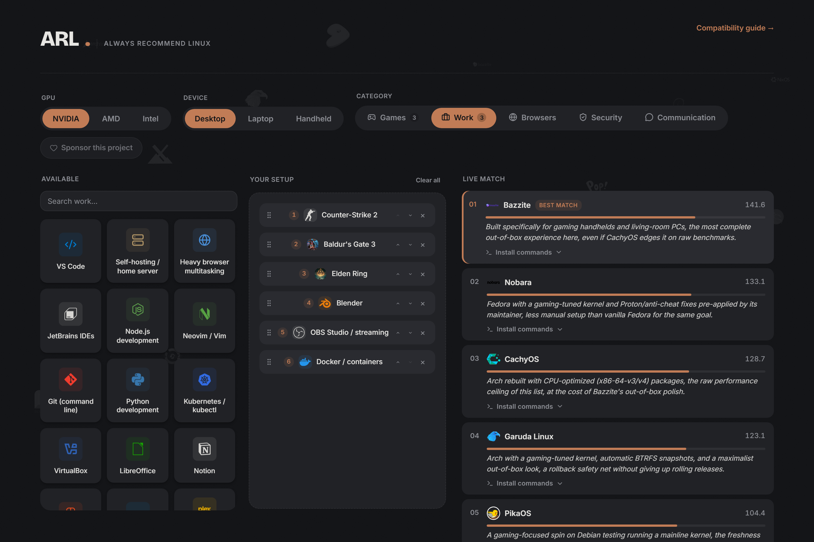
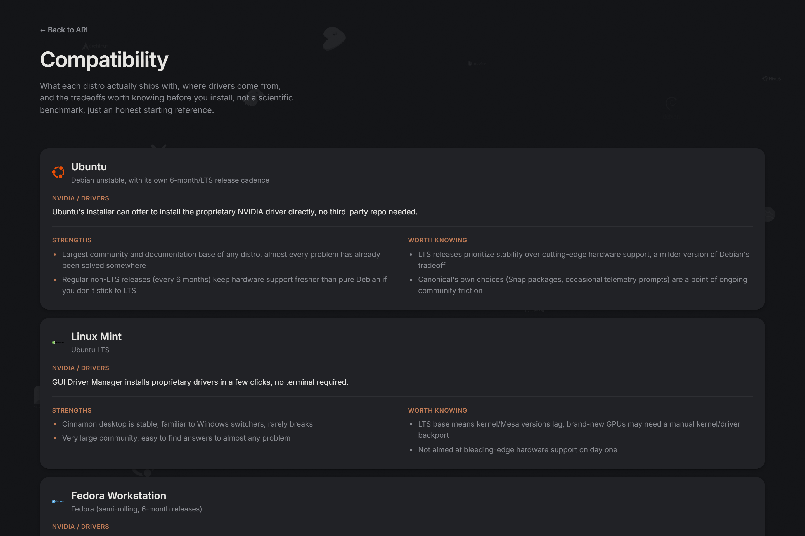

# Steep

**[Try it live →](https://andrew-most-likely.github.io/Interactive-Linux-distribution-recommendation-app/)**

An interactive, drag-and-drop Linux distro recommender. Instead of a
text-based questionnaire, you drag in the specific games, tools, and
preferences you actually use across five categories (games, work,
browsers, security, communication), pick your GPU and device type, and
watch match scores for 37 distros update live, with honest,
individually-reasoned explanations of the tradeoffs each one involves.

No login, no tracking, no server. Everything runs client-side in your
browser.

## Why this is different

Most distro-picker sites ask abstract questions ("do you game?") and hand
back a single flat verdict. Steep instead:

- Lets you drag in **specific, named software**, not vague categories
- Lets you **rank picks by importance** (drag to reorder) so your top
  priorities actually move the results
- Flags a distro **red** when something you picked genuinely won't run on
  it (e.g. an anti-cheat-protected game on any distro), instead of quietly
  burying it in the score
- Factors in your **actual GPU and device type** (desktop/laptop/handheld),
  NVIDIA's proprietary driver cares about kernel freshness far more than
  AMD/Intel's open-source stack does, and handhelds weight ease-of-use and
  gaming performance differently than a desktop workstation does
- Explains *why* each distro landed where it did, not just a number
- Ships a [compatibility guide](https://andrew-most-likely.github.io/Interactive-Linux-distribution-recommendation-app/#/distros)
  with real, distro-specific NVIDIA driver notes, strengths, and tradeoffs

## Compatibility guide

A separate `/distros` page gives every distro its own card: what it's
actually based on, how NVIDIA drivers are handled, and honest
strengths/tradeoffs, not a benchmark, just what's worth knowing before you
install.

## How scoring works

Each distro has a 0–10 score on a handful of dimensions (driver freshness,
stability, gaming performance, isolation, ease of use). Each draggable item
declares how much it needs from each dimension. Your GPU and device type
are scored at a fixed, modest weight of their own, and each software
item's *rank* in "Your setup" (drag to reorder) scales how much it
influences the result, with a steep falloff so your top pick actually
matters more than your sixth.

If a distro is meaningfully weak in a dimension an item cares about, a
tradeoff note is generated automatically. If it's *critically* weak on
something an item critically depends on (or the item is a game blocked by
kernel-level anti-cheat on Linux entirely), the distro is flagged red as
fundamentally incompatible rather than just penalized.

To add a new item: add it to `items.ts` with a requirements object. To add
a new distro: add it to `distros.ts` with an attributes object, package
manager, and a blurb. No other code changes needed. Scoring and tradeoffs
are derived automatically.

## Deploying to GitHub Pages

This repo already ships a GitHub Actions workflow
(`.github/workflows/deploy.yml`) that builds and deploys `main` to Pages on
every push. If you fork it:

1. In your fork's Settings → Pages, set the source to "GitHub Actions."
2. If your Pages site will live at `https://<user>.github.io/<repo>/` (not
   a custom domain at the root), update `base` in `vite.config.ts` to
   `'/<repo>/'`.
3. Push to `main`, the workflow builds and deploys automatically.

## License

MIT. See [LICENSE](LICENSE).
